# mini_trello


```markdown
# Mini Trello

A minimalist Trello-like Kanban board built with a full-stack architecture, featuring drag-and-drop task management.

---

## ⚙️ Tech Stack

- Framework: [React](https://reactjs.org/) + [Vite](https://vitejs.dev/)
- Language: TypeScript
- Styling: Emotion, MUI (Material-UI)
- State Management: Redux Toolkit
- Form Handling: React Hook Form + Yup
- Drag and Drop: DnD Kit [Source example](https://codesandbox.io/p/sandbox/react-dndkit-multiple-containers-6wydy9)
- Socket Communication: Socket.IO
- Routing: React Router

### Backend:
- Node.js + Express
- REST API
- Authentication and board/task endpoints

---

## 🚀 Getting Started

### Prerequisites

- Node.js (v18+)
- Yarn (preferred) or npm
- MongoDB or appropriate DB (check backend config)

### Install dependencies

```bash
# At project root
yarn install
````

### Start development servers

```bash
# Start frontend
cd apps/frontend
yarn dev

# Start backend
cd apps/backend
yarn dev

# Or start both, using concurrently
yarn dev
```

---

## 📌 Features
<details>
<summary><code>🔐 Authentication (Sign In/Up, including GitHub login)</code></summary>

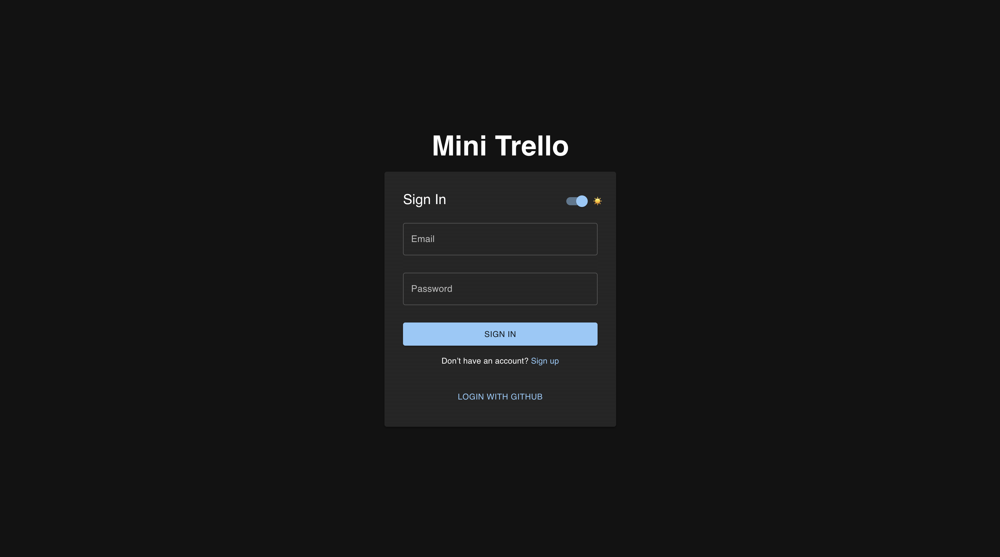
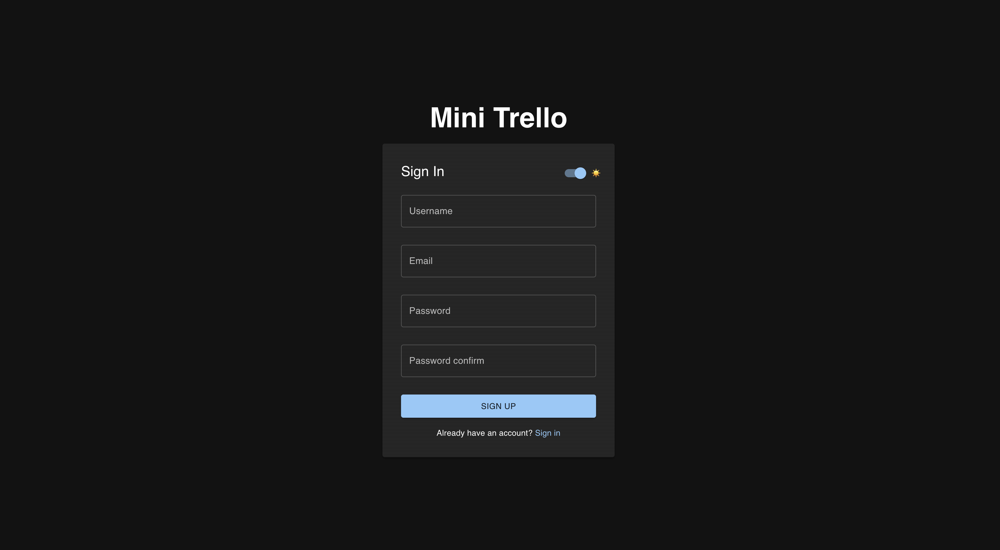

</details>

<details>
<summary><code>📋 Create, Update, and Delete Boards</code></summary>

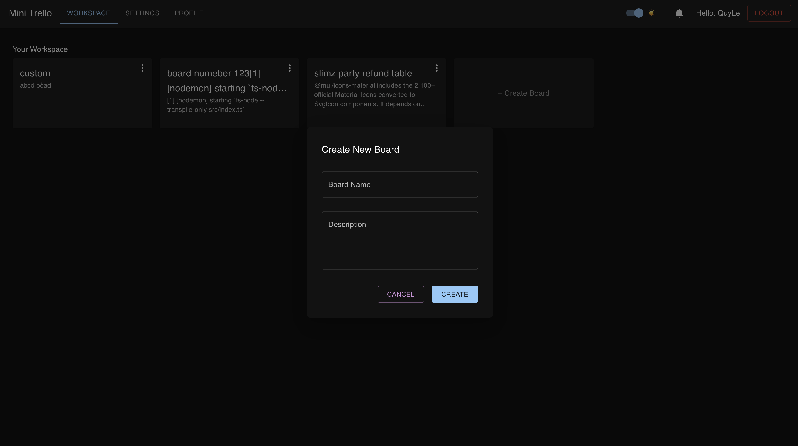
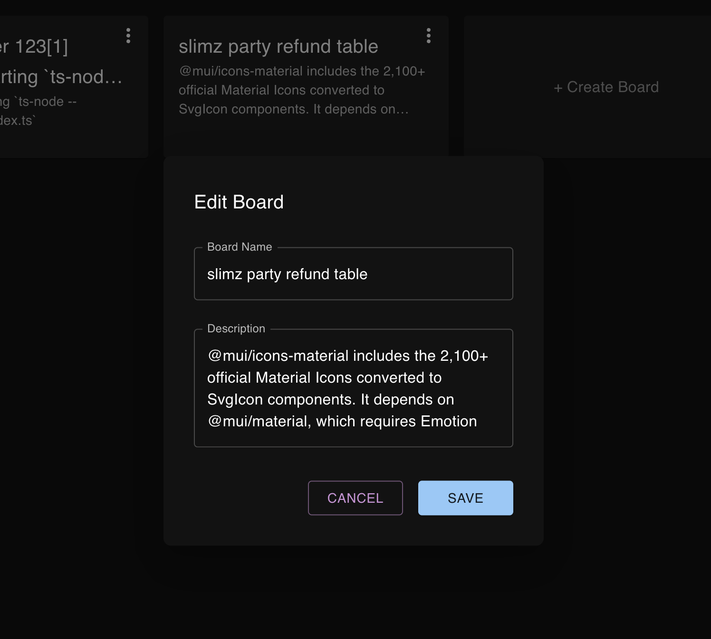
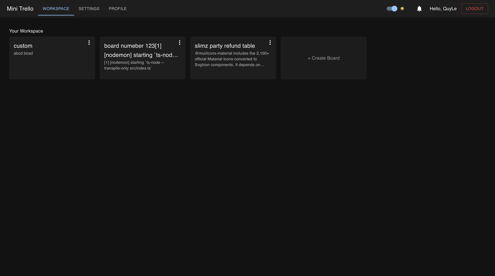

</details>

<details>
<summary><code>🗂️ Create, Update, and Delete Cards and Tasks</code></summary>

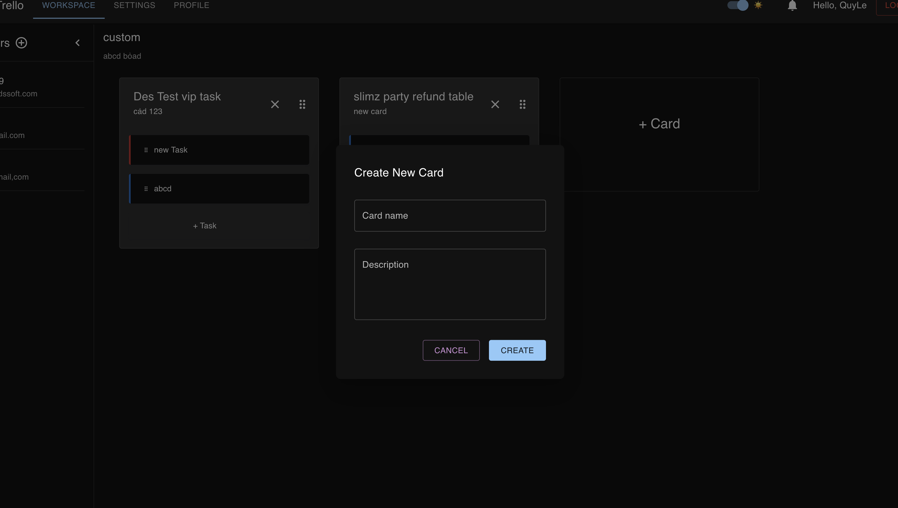
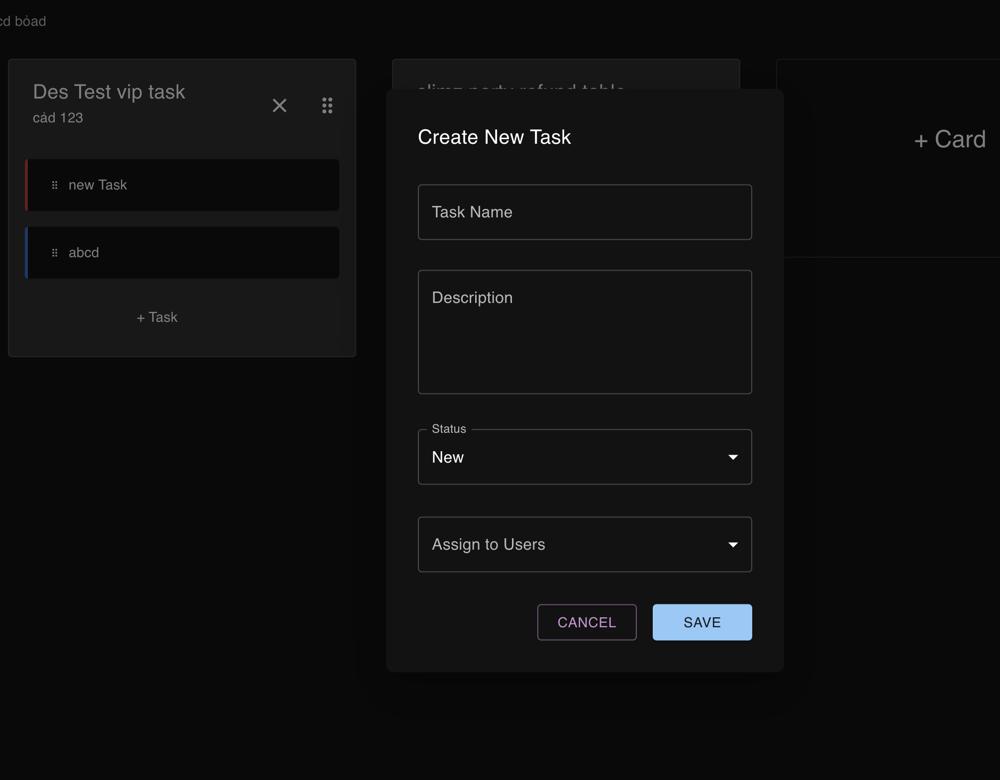
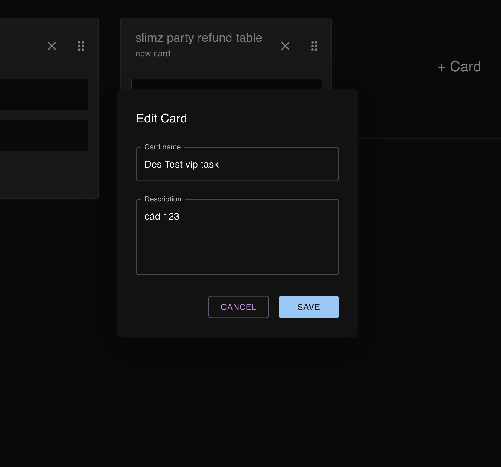
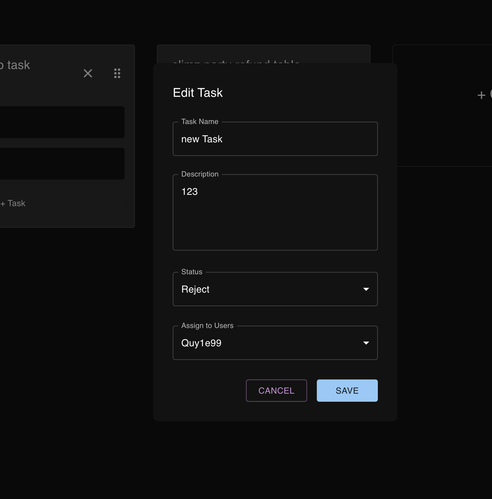

</details>

<details>
<summary><code>🔄 Real-time UI Updates</code></summary>

No image provided.

</details>

<details>
<summary><code>📱 Fully Responsive Layout</code></summary>

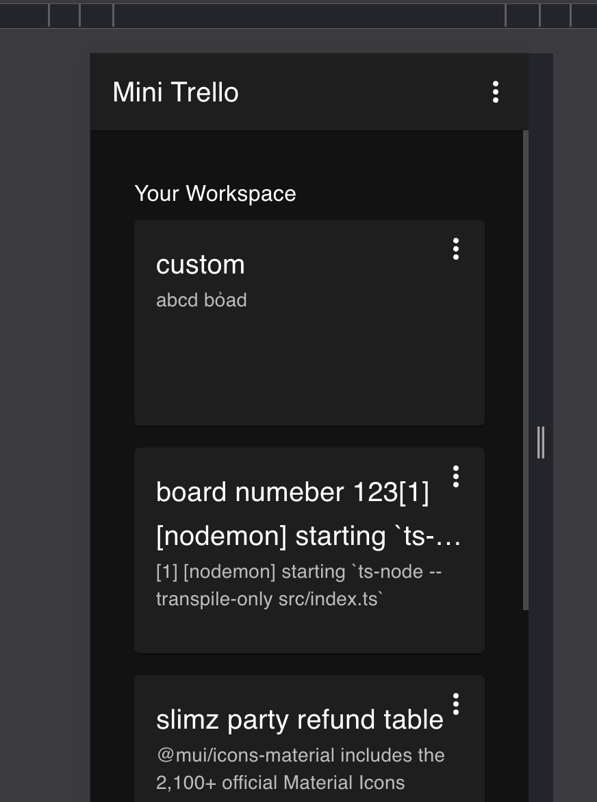
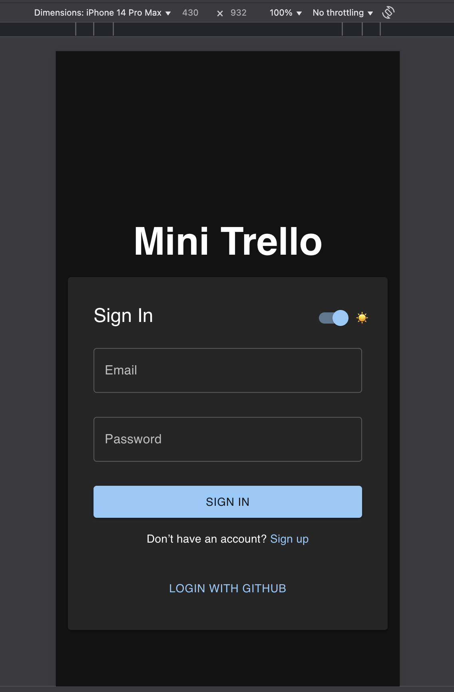

</details>

<details>
<summary><code>📨 User Invitations</code></summary>

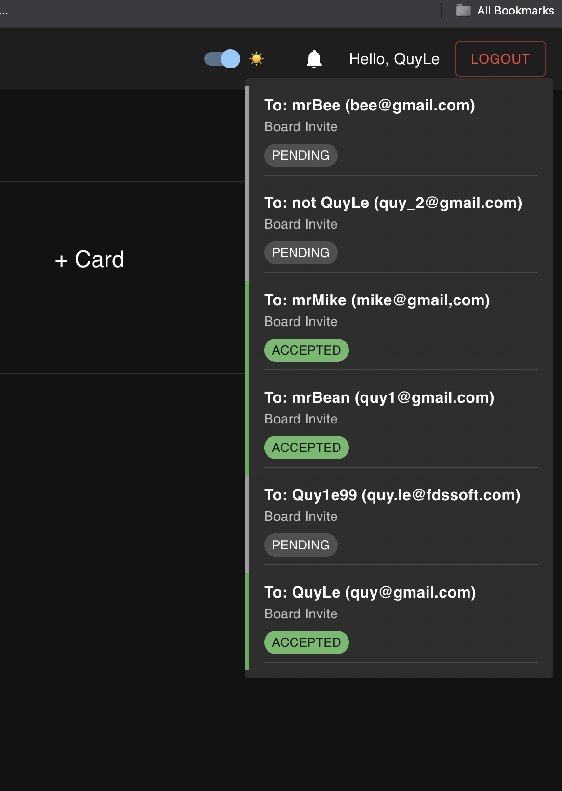
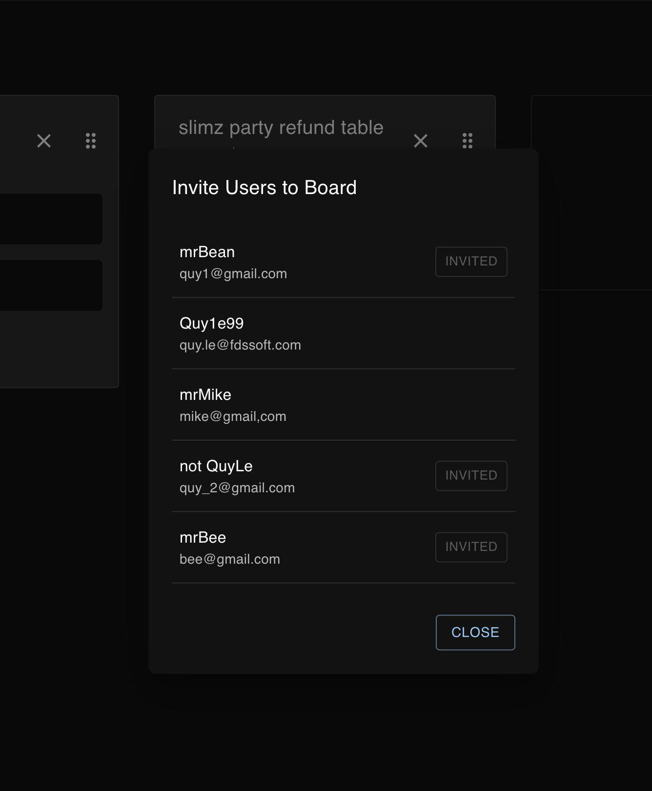

</details>

---

## 🧪 Scripts

| Location | Command    | Description              |
| -------- | ---------- | ------------------------ |
| frontend | `yarn dev` | Start React dev server   |
| backend  | `yarn dev` | Start backend API server |

---

## 🧱 Folder Structure
<details>
  <summary><code>lequy-123-mini_trello/</code></summary>

  <br/>

  ```text
  lequy-123-mini_trello/
  ├── README.md
  ├── package.json
  ├── .editorconfig
  ├── .prettierrc
  ├── apps/
  │   ├── backend/
  │   │   ├── nodemon.json
  │   │   ├── package.json
  │   │   ├── tsconfig.json
  │   │   ├── yarn.lock
  │   │   └── src/
  │   │       ├── firebase.ts
  │   │       ├── index.ts
  │   │       ├── socket.ts
  │   │       ├── middleware/
  │   │       │   ├── authMiddleware.ts
  │   │       │   └── checkBoardAccess.ts
  │   │       ├── routes/
  │   │       │   ├── auth.ts
  │   │       │   ├── boards.ts
  │   │       │   ├── cards.ts
  │   │       │   ├── invitations.ts
  │   │       │   ├── tasks.ts
  │   │       │   └── users.ts
  │   │       └── types/
  │   │           ├── Board.ts
  │   │           ├── Card.ts
  │   │           ├── express.d.ts
  │   │           ├── Task.ts
  │   │           └── User.ts
  │   └── frontend/
  │       ├── README.md
  │       ├── eslint.config.js
  │       ├── index.html
  │       ├── package.json
  │       ├── tsconfig.app.json
  │       ├── tsconfig.json
  │       ├── tsconfig.node.json
  │       ├── vite.config.ts
  │       ├── yarn.lock
  │       ├── .gitignore
  │       ├── public/
  │       └── src/
  │           ├── App.css
  │           ├── App.tsx
  │           ├── index.css
  │           ├── main.tsx
  │           ├── socket.ts
  │           ├── vite-env.d.ts
  │           ├── assets/
  │           ├── auth/
  │           │   ├── ProtectedRoute.tsx
  │           │   └── PublicRoute.tsx
  │           ├── components/
  │           │   ├── AppLayout.tsx
  │           │   ├── BoardList.tsx
  │           │   ├── CreateBoardModal.tsx
  │           │   ├── CreateCardModal.tsx
  │           │   ├── CreateTaskModal.tsx
  │           │   ├── CustomTextField.tsx
  │           │   ├── DrawerLayout.tsx
  │           │   ├── ErrorPage.tsx
  │           │   ├── InvitationDropdown.tsx
  │           │   ├── LoadingPage.tsx
  │           │   ├── NotFoundPage.tsx
  │           │   ├── UserInvitationModal.tsx
  │           │   ├── UserList.tsx
  │           │   ├── DragDrop/
  │           │   │   ├── MultipleContainers.tsx
  │           │   │   └── components/
  │           │   │       ├── Container.tsx
  │           │   │       ├── DroppableContainer.tsx
  │           │   │       ├── index.ts
  │           │   │       ├── Item.tsx
  │           │   │       └── SortableItem.tsx
  │           │   └── DragDropSet/
  │           │       ├── CardComponent.tsx
  │           │       ├── CardList.tsx
  │           │       └── TaskComponent.tsx
  │           ├── pages/
  │           │   ├── BoardDetail.tsx
  │           │   ├── Boards.tsx
  │           │   ├── GitHubCallback.tsx
  │           │   ├── Profile.tsx
  │           │   ├── Settings.tsx
  │           │   ├── SignIn.tsx
  │           │   └── SignUp.tsx
  │           ├── services/
  │           │   ├── apiClient.ts
  │           │   ├── authService.ts
  │           │   ├── boardService.ts
  │           │   ├── cardService.ts
  │           │   ├── invitationService.ts
  │           │   └── taskService.ts
  │           ├── store/
  │           │   ├── authSlice.ts
  │           │   ├── boardSlice.ts
  │           │   ├── cardSlice.ts
  │           │   ├── hooks.ts
  │           │   ├── index.ts
  │           │   ├── invitationSlice.ts
  │           │   ├── taskSlice.ts
  │           │   └── themeSlice.ts
  │           └── utils/
  │               ├── helper.ts
  │               ├── type.ts
  │               ├── useAuth.ts
  │               ├── useBoard.ts
  │               ├── useCard.ts
  │               ├── useCustomTheme.ts
  │               ├── useInvitation.ts
  │               ├── useSocket.ts
  │               └── useTask.ts
  └── assets/
```
</details>

---

## 📄 License

MIT License

---

## ✨ Author

**LeQuy**
[GitHub](https://github.com/LeQuy-123)

